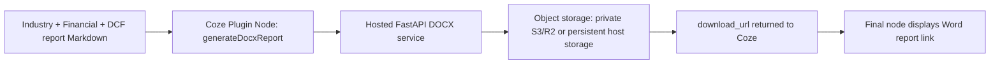

# Deploying the DOCX Download Plugin in Coze

## 1. What This Plugin Does

The plugin receives the completed report as Markdown, converts Markdown tables into editable Word tables, embeds permitted chart images, applies a formal A4 report format with a vertically and horizontally centred cover and populated contents page, stores the generated `.docx`, and returns a clickable download URL. Tables use 12 pt single-spaced cells with 1.5 pt outer horizontal rules and a 0.5 pt rule beneath the first row; list paragraphs are justified. It applies a three-level report hierarchy (report title, main section, subsection), keeps Section 1 with its report title, and starts later reports and subsequent main sections on new pages. Chart notes render directly under the relevant chart, rather than before it, and Markdown horizontal rules do not create blank separator paragraphs. It suppresses duplicate generated chart titles and converts numbered in-text citations into superscript internal Word links to their numbered reference bookmarks. The converter deliberately excludes contribution-statement and declaration forms. On 512MB Render instances, the recommended low-memory mode avoids headless LibreOffice and uses stored contents entries to prevent field-refresh prompts while preserving the full report body, editable tables, embedded charts and internal reference links.

This should be deployed as a public HTTPS API and imported into Coze as a cloud plugin. A Coze code node is not suitable for the final document download step because the Word file needs a stable or time-limited public URL after the workflow finishes.



## 2. Files Already Provided

Use the following deployment files in this folder:

| File | Purpose |
| --- | --- |
| `app.py` | Public FastAPI endpoint: `POST /generate-docx` |
| `docx_converter.py` | Markdown-to-DOCX conversion, table and chart handling |
| `finalize_docx.py` | Optional headless LibreOffice Contents and page-field finalization for larger instances |
| `requirements.txt` | Python dependencies |
| `Dockerfile` | Container deployment configuration |
| `.env.example` | Required runtime settings |
| `.dockerignore` | Excludes credentials and generated files from container builds |
| `openapi.yaml` | Coze plugin import definition |
| `test_from_payload.py` | Local conversion verification |

The API contract is:

```json
{
  "formatted_markdown": "# Report title\n\n| Metric | Value |\n| --- | --- |\n| Revenue | 100 |",
  "title": "Corporate Valuation Report: WuXi AppTec (603259)",
  "to_format": "docx",
  "include_images": true
}
```

The response includes `download_url`, `table_count`, `image_count`, and `skipped_image_count`. Retain the count fields during testing so a missing chart or a failed table conversion is visible.

## 3. Test the API Locally

Open PowerShell in the `Word Document Plugin` folder and run:

```powershell
python -m venv .venv
.\.venv\Scripts\Activate.ps1
pip install -r requirements.txt
$env:STORAGE_MODE = "local"
$env:PUBLIC_BASE_URL = "http://localhost:8000"
$env:DOCX_API_KEY = "replace-with-a-long-random-secret"
$env:FINALIZE_FIELDS = "false"
$env:DOCX_FINALIZATION_MODE = "static"
$env:SOFFICE_PATH = "C:\Program Files\LibreOffice\program\soffice.exe"
$env:DOCX_FINALIZER_PYTHON = "C:\Program Files\LibreOffice\program\python.exe"
uvicorn app:app --host 0.0.0.0 --port 8000
```

In a second PowerShell window, confirm the server is running:

```powershell
Invoke-RestMethod -Method Get -Uri "http://localhost:8000/health"
```

Test Word generation:

```powershell
$headers = @{
    "X-API-Key" = "replace-with-a-long-random-secret"
    "Content-Type" = "application/json"
}
$body = @{
    formatted_markdown = "# Test Report`n`n| Metric | Value |`n| --- | --- |`n| Revenue | RMB 100m |"
    title = "DOCX Plugin Test"
    to_format = "docx"
    include_images = $false
} | ConvertTo-Json
Invoke-RestMethod -Method Post -Uri "http://localhost:8000/generate-docx" -Headers $headers -Body $body
```

The result should contain a URL under `download_url` and `table_count` should be `1`.

## 4. Choose Storage Before Deployment

### 4.1 Initial Testing

Use `STORAGE_MODE=local` only when the deployed API keeps its `generated_files` directory and publicly serves `/files/...`.

```env
STORAGE_MODE=local
PUBLIC_BASE_URL=https://your-api-domain.example.com
DOCX_API_KEY=replace-with-a-long-random-token
IMAGE_HOST_ALLOWLIST=lf-bot-studio-plugin-resource.coze.cn
FINALIZE_FIELDS=false
DOCX_FINALIZATION_MODE=static
DOCX_UPDATE_FIELDS_ON_OPEN=false
```

### 4.2 Recommended Production Setup

Use a private S3-compatible bucket, such as Cloudflare R2 or AWS S3. The API uploads each DOCX to object storage and, by default, returns an API-hosted download link that remains valid for three months. This avoids relying on a long R2/S3 presigned URL, because S3-compatible presigned URLs cannot be safely extended to three months.

```env
STORAGE_MODE=s3
PUBLIC_BASE_URL=https://your-service.onrender.com
DOCX_API_KEY=replace-with-a-long-random-token
IMAGE_HOST_ALLOWLIST=lf-bot-studio-plugin-resource.coze.cn
S3_ENDPOINT_URL=https://<account-id>.r2.cloudflarestorage.com
S3_BUCKET=coze-generated-reports
S3_REGION=auto
S3_ACCESS_KEY_ID=<access-key-id>
S3_SECRET_ACCESS_KEY=<secret-access-key>
S3_KEY_PREFIX=generated-docx
USE_PROXY_DOWNLOAD_URLS=true
DOWNLOAD_LINK_EXPIRY_SECONDS=7776000
DOWNLOAD_LINK_SECRET=replace-with-a-long-random-token-or-use-DOCX_API_KEY
FINALIZE_FIELDS=false
DOCX_FINALIZATION_MODE=static
DOCX_UPDATE_FIELDS_ON_OPEN=false
MALLOC_ARENA_MAX=2
DOCX_IMAGE_MAX_WIDTH_PX=1400
DOCX_IMAGE_MAX_HEIGHT_PX=1000
```

Leave `S3_PUBLIC_BASE_URL` unset for private reports. When it is unset and `USE_PROXY_DOWNLOAD_URLS=true`, the plugin returns a link like `/download/<file_name>?expires=...&signature=...`. When the user opens that link, the API verifies the signature and streams the file from R2/S3. The default `DOWNLOAD_LINK_EXPIRY_SECONDS=7776000` equals 90 days.

If `USE_PROXY_DOWNLOAD_URLS=false`, the API falls back to a native R2/S3 presigned URL. Keep `S3_URL_EXPIRY_SECONDS` at or below `604800` seconds (7 days). Cloudflare states that R2 presigned URLs operate on its S3 API domain and should be treated as bearer links until they expire; they cannot be extended after creation.

Expired generated links cannot be edited in place. If the object still exists in R2/S3, generate a new download link by rerunning the report workflow or by calling `POST /refresh-download-url` with the existing `file_name`. If the object has been deleted by a lifecycle rule or manual cleanup, the document must be regenerated.

Refresh example:

```json
{
  "file_name": "Corporate_Valuation_Report_abc123.docx"
}
```

For local testing, the API loads a `.env` file in this folder automatically. When deploying on Render or another host, enter these values in the host's secret environment-variable settings; do not commit `.env` or raw R2 credential files to source control.

## 5. Deploy the API to a Public HTTPS Domain

Any public container host that runs the supplied `Dockerfile` can host this service. The following is a concrete Render setup:

1. Use the `word_document_covert` GitHub repository as the Render source.
2. In Render, create a new **Web Service** and select the repository.
3. Leave **Root Directory** blank for this standalone repository because `Dockerfile` is already at its root.
4. Select the Docker runtime so Render builds the included `Dockerfile`.
5. Add the environment variables from section 4 as secrets.
6. Under **Settings**, configure the HTTP **Health Check Path** as `/health`.
7. If automatic deployment is enabled, use **On Commit** unless the repository has CI checks. Render does not trigger an **After CI Checks Pass** deploy when no checks are detected.
8. Deploy the service and copy its public HTTPS domain, for example `https://your-service.onrender.com`.
9. Open `https://your-service.onrender.com/health`. It should return `{"status":"ok", ...}`.

The Dockerfile installs LibreOffice for optional Contents finalization and starts Uvicorn on the `PORT` environment variable expected by a hosted web service. For 512MB Render instances, keep `FINALIZE_FIELDS=false` and `DOCX_FINALIZATION_MODE=static`; this avoids the LibreOffice memory spike while still returning a complete DOCX. Use `DOCX_FINALIZATION_MODE=libreoffice` only after upgrading the instance memory.

On Render's free web-service plan, an idle service spins down after 15 minutes without inbound traffic and displays an application-loading page while waking; Render states that wake-up normally takes about one minute. If `/health` remains on that page for more than a few minutes, inspect the Render **Events** deployment log and **Logs** page for a startup or port-binding error.

## 6. Prepare the OpenAPI File for Coze

Before import, edit `openapi.yaml` and replace this placeholder:

```yaml
servers:
  - url: https://YOUR-DOCX-PLUGIN-DOMAIN.example.com
```

with your deployed API domain:

```yaml
servers:
  - url: https://your-service.onrender.com
```

Do not use `localhost` or an IP address. The official Coze import guide states that the plugin URL must be a domain-name URL and does not support an IP URL.

## 7. Import and Publish the Plugin in Coze

The route below follows Coze's official **Create a plugin by importing a JSON or YAML file** procedure:

1. Log in to Coze and select the workspace where the workflow is stored.
2. Open **Library**, click **+ Resource**, and choose **Plugin**.
3. Click **Import**.
4. Choose **Local file**, upload the edited `openapi.yaml`, and click **Next**. Coze also permits import from a URL or raw JSON/YAML data.
5. Enter a clear plugin name, such as `Markdown Report to DOCX`, and a description stating that it creates an editable Word report and returns a download link.
6. Confirm that the automatically populated plugin URL is your public API domain.
7. For authorization, select service-token/API-key authorization:

| Setting | Value |
| --- | --- |
| Location | `Header` |
| Parameter name | `X-API-Key` |
| Parameter value | The same secret as `DOCX_API_KEY` on the API host |

8. Complete plugin creation. The imported tool will appear as `generateDocxReport`.
9. Enable the tool and click **Debug**. Use this test input:

```json
{
  "formatted_markdown": "# DOCX Plugin Debug Test\n\n| Metric | Value |\n| --- | --- |\n| Revenue | RMB 100m |",
  "title": "DOCX Plugin Debug Test",
  "to_format": "docx",
  "include_images": false
}
```

10. Confirm that debugging succeeds and that the returned `download_url` opens a Word file containing an editable table.
11. Click **Done**, then click **Publish** on the plugin page.
12. Complete Coze's privacy-information question based on the actual report content handled by your workflow.

A plugin must be published before an agent or workflow can use it.

## 8. Add the Plugin to the Combined Analysis Workflow

Coze's official Plugin node documentation states that a workflow plugin node uses the input and output structure defined by the tool. Add the plugin after your final integrated report Markdown has been generated.

1. In the workflow canvas, click **Add node**, choose **Plugin**, and select `Markdown Report to DOCX` > `generateDocxReport`.
2. Map the input parameters as follows:

| Plugin Input | Workflow Value |
| --- | --- |
| `formatted_markdown` | The final integrated industry, financial, and DCF report Markdown |
| `title` | A report title, such as `Corporate Valuation Report: {{company_name}} ({{stock_code}})` |
| `to_format` | Fixed value: `docx` |
| `include_images` | Fixed value: `true` |

3. Add a final output node after the plugin and return the generated link:

```markdown
Word report download link: {{generateDocxReport.download_url}}
```

4. While testing, also display these fields:

```markdown
Converted tables: {{generateDocxReport.table_count}}
Embedded charts: {{generateDocxReport.image_count}}
Skipped charts: {{generateDocxReport.skipped_image_count}}
```

5. If charts are included, allow sufficient plugin-node execution time; Coze's plugin-node guide supports configuring timeouts up to 180 seconds and one retry.

## 9. End-to-End Validation Checklist

Before using the workflow for a final report, run one full case and confirm:

| Check | Expected Result |
| --- | --- |
| Plugin debug | Returns a non-empty `download_url` |
| Authentication | Incorrect `X-API-Key` returns an authorization failure |
| Title | Filename and Word title correspond to the selected target company |
| Tables | Valuation and ratio tables are editable Word tables, not long text blocks |
| Images | Available charts are embedded; skipped chart count is reviewed |
| Download URL | Opens after the workflow finishes and remains accessible for the intended period |
| Privacy | Generated reports are not retained publicly longer than necessary |

## 10. Common Problems

| Symptom | Likely Cause | Fix |
| --- | --- | --- |
| Coze import rejects the plugin URL | `openapi.yaml` still contains a placeholder, `localhost`, or an IP address | Replace it with the deployed HTTPS domain |
| Debug returns `401` | Coze service-token value differs from `DOCX_API_KEY` | Use the same secret in Coze and the host environment |
| Link is returned but the file cannot be downloaded | `PUBLIC_BASE_URL` is incorrect or local storage is not persistent | Correct the public domain or use `STORAGE_MODE=s3` |
| Coze receives `502` and Render says out of memory | A full report plus LibreOffice field finalization exceeds the 512MB instance limit | Keep `FINALIZE_FIELDS=false`, `DOCX_FINALIZATION_MODE=static`, and the image-size environment variables enabled, or upgrade Render memory |
| Charts are missing in Word | Chart host is not allowed or the source URL has expired | Add only the trusted chart host to `IMAGE_HOST_ALLOWLIST` and regenerate |
| A chart still shows a title inside the image | The PNG was created by an older ECharts node whose `option` included `title` | Update the ECharts node, rerun Chart Master to create new PNG links, and then regenerate the DOCX |
| A report table is not editable | Input did not contain valid Markdown pipe-table syntax | Check the final Markdown supplied to `formatted_markdown` |

## Official and Deployment References

- Coze, [Create a plugin by importing a JSON or YAML file](https://www.coze.com/open/docs/guides/plugin_import)
- Coze, [Create a plugin based on API](https://www.coze.com/open/docs/guides/plugin_example)
- Coze, [Plugin node](https://www.coze.com/open/docs/guides/plugin_node)
- Render, [Deploy a FastAPI App](https://render.com/docs/deploy-fastapi)
- Render, [Web Services](https://render.com/docs/web-services)
- Cloudflare, [R2 Presigned URLs](https://developers.cloudflare.com/r2/api/s3/presigned-urls/)
